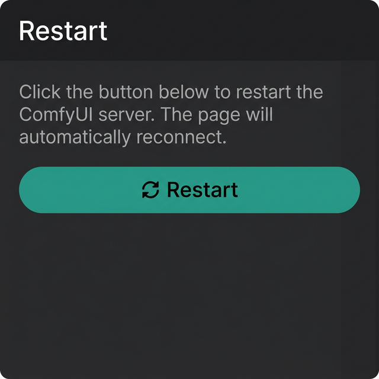

# 🔄 ComfyUI Restart Node

A lightweight custom node for [ComfyUI](https://github.com/comfyanonymous/ComfyUI) that adds a **one-click server restart** button directly in the sidebar panel.


---

<p align="center">
  
</p>

---

## ✨ Features

- 🔄 **Sidebar Restart Button** — Adds a dedicated "Restart" tab to the ComfyUI sidebar
- ⚡ **One-Click Restart** — Restart the server without touching the terminal
- 🔁 **Auto-Reconnect** — Automatically detects when the server is back and reloads the page
- 🖥️ **Cross-Platform** — Works on Windows, Linux, and macOS
- 🎨 **Native UI** — Blends seamlessly with the ComfyUI interface

---

## 📦 Installation

### Method 1: Git Clone (Recommended)

```bash
cd ComfyUI/custom_nodes
git clone https://github.com/dna1989/comfy-Ui.git reboot
```

Then restart ComfyUI.

### Method 2: Manual Download

1. Download this repository as a ZIP
2. Extract it into `ComfyUI/custom_nodes/reboot/`
3. Restart ComfyUI

---

## 🚀 Usage

1. After installation, you'll see a **🔄 refresh icon** in the left sidebar of ComfyUI
2. Click the icon to open the **Restart** panel
3. Click the **"🔄 Restart"** button
4. Confirm the restart when prompted
5. The page will automatically reload once the server is back online

---

## 📁 Project Structure

```
reboot/
├── __init__.py          # ComfyUI extension entry point
├── reboot.py            # Server restart route handler
├── js/
│   └── reboot.js        # Sidebar panel UI (frontend)
├── requirements.txt     # Python dependencies
├── LICENSE              # MIT License
├── .gitignore           # Git ignore rules
└── README.md            # This file
```

---

## ⚙️ How It Works

**Backend (`reboot.py`)**
- Registers a POST route at `/reboot`
- Spawns a new ComfyUI process using `subprocess.Popen`
- Exits the current process with `os._exit(0)`

**Frontend (`js/reboot.js`)**
- Registers a sidebar tab via `app.extensionManager.registerSidebarTab`
- Sends a POST request to `/reboot` on button click
- Polls `/system_stats` every second to detect when the server is back
- Auto-reloads the page upon reconnection

---

## 🛠️ Requirements

- **ComfyUI** (latest version recommended)
- **Python** 3.10+
- No additional pip packages required (uses `aiohttp` bundled with ComfyUI)

---


## 📄 License

This project is licensed under the **MIT License** — see the [LICENSE](LICENSE) file for details.

---

## 👤 Author

**dna1989** — [GitHub Profile](https://github.com/dna1989)

---

<p align="center">
  Made with ❤️ for the ComfyUI community
</p>
